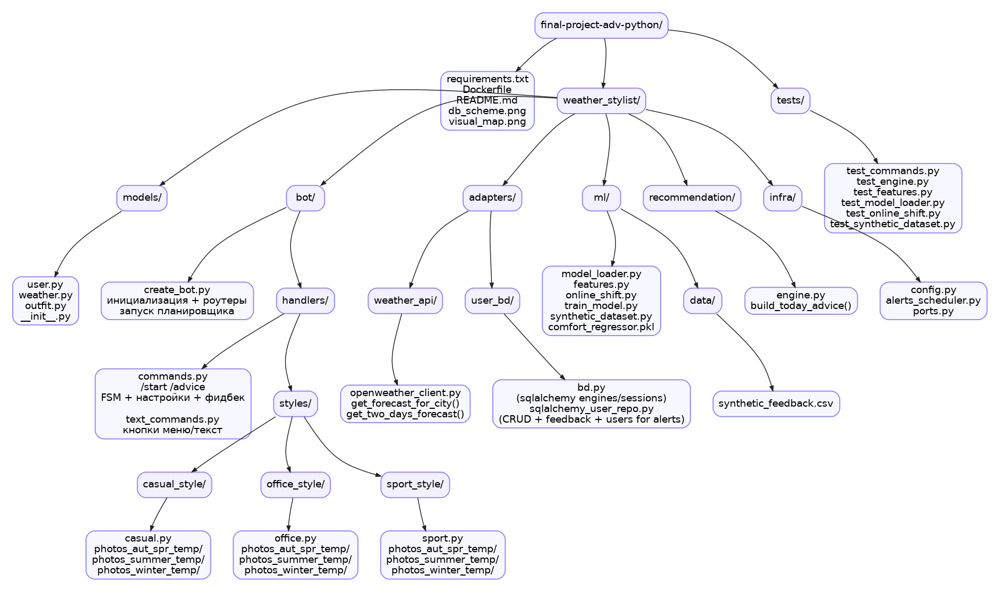
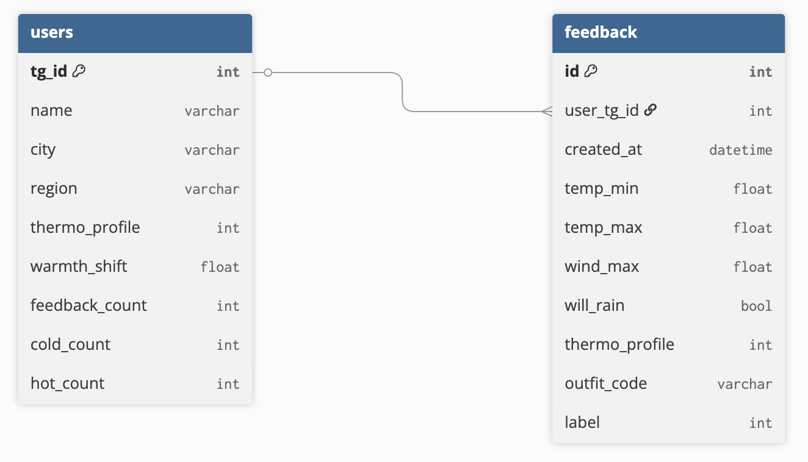
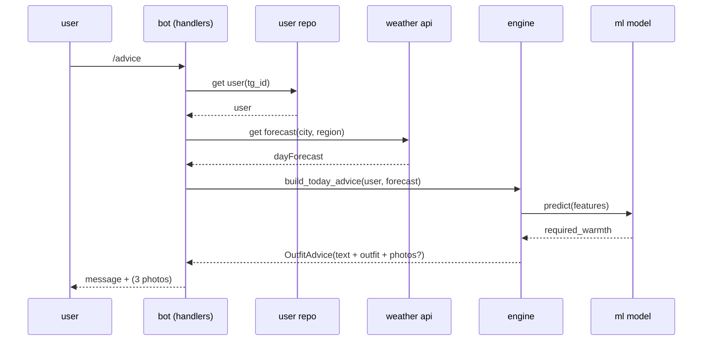
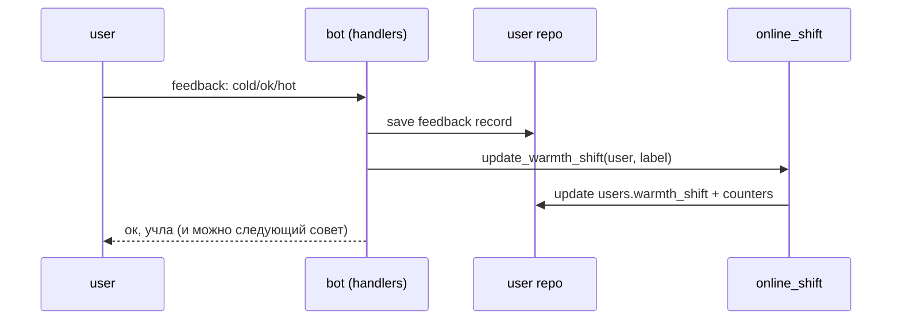

# hse-python-advanced-project

# проект: miranda weather stylist bot (telegram-бот стилист по погоде)

## 1. описание продукта

**Miranda weather stylist bot** — это telegram-бот, который советует одежду на сегодня по прогнозу погоды. внутри есть маленькая ml моделька, которая помогает персонализировать “насколько тепло надо одеться”.

бот учитывает:

* город и район пользователя (city/region)
* термочувствительность (`thermo_profile`: мне холодно / норм / жарко)
* выбранный стиль (casual / office / sport)
* персональный сдвиг тепла `warmth_shift` (меняется от фидбека)

### 1.1. проблема

люди часто смотрят температуру и все равно ошибаются, потому что:

* “ощущается как” не равна реальному комфорту (ветер, дождь, перепады)
* у всех разная термочувствительность
* советы в погодных приложениях обычно слишком общие и без стиля

### 1.2. идея и цель

сделать бота, который:

* быстро дает понятный совет “что надеть” (текстом) + структуру комплекта
* постепенно подстраивается под человека по фидбеку (онлайн адаптация)
* может показывать фото-референсы образов из папок по стилям

---

## 2. что видит пользователь

пользователь общается с ботом в telegram

### 2.1. сценарии (use cases)

#### сценарий 1: “получить совет на сегодня”

1. пользователь жмет кнопку “совет на сегодня”
2. бот берет прогноз погоды по городу (если город не установлен, предлагает ввести название)
3. машинка выдает совет поэлементам одежды, учитывая температуру и фидбэк
4. бот отправляет этот совет

#### сценарий 2: “настроить профиль”

1. пользователь открывает “настройки”
2. выбирает город, стиль, термопрофиль
3. бот сохраняет изменения в бд и дальше учитывает их

#### сценарий 3: “дать фидбек”

1. после совета пользователь выбирает реакцию типа “холодно / норм / жарко”
2. бот сохраняет запись в `feedback`
3. бот обновляет `warmth_shift` и счетчики (cold/hot count), чтобы следующие советы стали точнее

#### сценарий 4: “алерты по погоде” (если включено)

1. планировщик периодически проверяет погоду
2. если дождь скоро или резкая смена — бот шлет уведомление

---

## 3. архитектура и технологии

проект монолитный (один бот), но внутри разложен по слоям: bot / core engine / adapters / ml / infra.

### 3.1. технологический стек

* **python:** 3.12+
* **telegram bot:** aiogram 3.x (asyncio)
* **http:** aiohttp
* **db:** sqlite
* **orm:** sqlalchemy
* **ml:** scikit-learn + numpy/pandas
* **tests:** pytest
* **infra:** docker (dockerfile)

### 3.2. архитектура системы (components)



---

## 4. структура базы данных (по твоей схеме)

в базе две таблицы: `users` и `feedback`.

* `users` — настройки пользователя + текущие персональные параметры
* `feedback` — события обратной связи (что совет был холодный/норм/жаркий) + погодные фичи и код outfit

### 4.1. bd диаграмма (sqlite)




---

## 5. организация кода (project structure)

```mermaid
graph TD
    ROOT["final-project-adv-python/"] --> WS["weather_stylist/"]
    ROOT --> TESTS["tests/"]
    ROOT --> DOCS["README.md<br/>Dockerfile<br/>requirements.txt<br/>db_scheme.png<br/>miranda_arch_map.png"]
    
    WS --> MODELS["models/"]
    WS --> BOT["bot/"]
    WS --> ADAPTERS["adapters/"]
    WS --> ML["ml/"]
    WS --> REC["recommendation/"]
    WS --> INFRA["infra/"]
    
    MODELS --> M1["user.py"]
    MODELS --> M2["weather.py"]
    MODELS --> M3["outfit.py"]
    MODELS --> M4["__init__.py"]
    
    BOT --> B1["create_bot.py"]
    BOT --> HANDLERS["handlers/"]
    HANDLERS --> H1["commands.py"]
    HANDLERS --> H2["text_commands.py"]
    HANDLERS --> STYLES["styles/"]
    STYLES --> CASUAL["casual_style/<br/>casual.py + photos"]
    STYLES --> OFFICE["office_style/<br/>office.py + photos"]
    STYLES --> SPORT["sport_style/<br/>sport.py + photos"]
    
    ADAPTERS --> WEATHER_API["weather_api/<br/>openweather_client.py"]
    ADAPTERS --> USER_BD["user_bd/"]
    USER_BD --> UB1["bd.py"]
    USER_BD --> UB2["sqlalchemy_user_repo.py"]
    
    ML --> ML1["model_loader.py"]
    ML --> ML2["features.py"]
    ML --> ML3["online_shift.py"]
    ML --> ML4["train_model.py"]
    ML --> ML5["synthetic_dataset.py"]
    ML --> ML6["comfort_regressor.pkl"]
    ML --> ML_DATA["data/<br/>synthetic_feedback.csv"]
    
    REC --> REC1["engine.py"]
    
    INFRA --> INF1["alerts_scheduler.py"]
    INFRA --> INF2["ports.py"]
    INFRA --> INF3["__init__.py"]
    
    TESTS --> T1["test_commands.py"]
    TESTS --> T2["test_engine.py"]
    TESTS --> T3["test_features.py"]
    TESTS --> T4["test_model_loader.py"]
    TESTS --> T5["test_online_shift.py"]
    TESTS --> T6["test_synthetic_dataset.py"]
    
    style ROOT fill:#e1f5ff
    style WS fill:#fff4e1
    style MODELS fill:#e8f5e9
    style BOT fill:#f3e5f5
    style ADAPTERS fill:#fff9c4
    style ML fill:#ffebee
    style REC fill:#e0f2f1
    style INFRA fill:#fce4ec
    style TESTS fill:#e8eaf6
```



---

## 6. как работает ml часть

### 6.1. обучение (offline)

* `synthetic_dataset.py` генерит синтетические примеры “погода + профиль → комфорт”
* `train_model.py` обучает регрессор и сохраняет `comfort_regressor.pkl`

### 6.2. применение в рантайме

* `model_loader.py` лениво грузит модель 1 раз (кеширует)
* `features.py` собирает фичи из `DayForecast` и `User`
* движок в `engine.py` делает предикт “сколько тепла надо”
* потом добавляется поправка: `thermo_profile` + `warmth_shift`

### 6.3. online адаптация (warmth_shift)

* пользователь ставит фидбек (label)
* `online_shift.update_warmth_shift()` обновляет `users.warmth_shift`
* и растут счетчики feedback_count / cold_count / hot_count (для статистики)

---

## 7. flow 

### 7.1. “совет на сегодня”




### 7.2. фидбек




---

## 8. запуск и тестирование

### 8.1. локальный запуск

1. зависимости:

```bash
pip install -r requirements.txt
```

2. запуск бота:

```bash
python -m weather_stylist.bot.create_bot
```

важно: должен быть настроен токен бота и ключ к weather api (обычно через env переменные), иначе оно не взлетит.

### 8.2. запуск через docker

```bash
docker build -t miranda-bot 
docker run --env-file .env miranda-bot
```

если поменяли код:

```bash
docker build -t miranda-bot 
```

### 8.3. тесты

```bash
pytest -q
```

выборочно:

```bash
pytest -q tests/test_engine.py
pytest -q tests/test_online_shift.py
```

---

## 9. mvp и роли

команда: **Аня**, **Ева**, **Саша**, **Маша**

| задача          | что делаем                           | оценка | ответственный |
| --------------- | ------------------------------------ | ------ | ------------- |
| core engine     | правила + сбор outfitAdvice          | 6–10ч  | **Аня**       |
| weather adapter | клиент api + маппинг в DayForecast   | 2–4ч   | **Маша, Аня**       |
| db + repo       | users/feedback таблицы + репозиторий | 4–6ч   | **Ева**       |
| ui бота         | команды, кнопки, fsm настроек        | 6–12ч  | **Аня**, **Саша**, **Маша**     |
| ml              | синтетика + регрессор + loader       | 6–10ч  | **Маша, Аня**      |
| online shift    | обновление warmth_shift по фидбеку   | 2–4ч   | **Маша**      |
| tests           | pytest на engine/features/shift      | 6–12ч  | **Аня**, **Саша**, **Маша**, **Ева** (по модулям) |
| docker          | dockerfile, запуск, readme           | 1–3ч   | **Ева**       |

